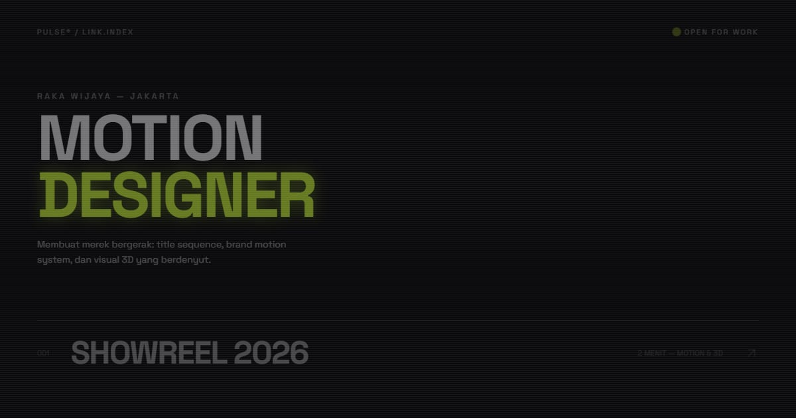

# PULSE — Raka Wijaya, Motion Designer

Link in bio motion & visual designer Raka Wijaya: showreel, karya, dan kontak — semuanya di sini.

**Demo live:** https://linkinbio-pulse.vercel.app



> Template link-in-bio dengan persona fiktif.

## Konsep

Persona Raka Wijaya, motion designer. Baris tautan tipografi neon berukuran raksasa yang miring saat disorot, dengan scanline halus.

## Halaman

`/`

## Teknologi

- Next.js 15.5 (App Router) dan React 19
- Tailwind CSS v4
- JavaScript
- Framer Motion, Lucide (ikon)
- Font: Space Grotesk, JetBrains Mono (next/font)
- SEO: metadata per halaman, Open Graph, JSON-LD, sitemap.xml, dan robots.txt

## Menjalankan secara lokal

```bash
npm install
npm run dev
```

Buka http://localhost:3000. Untuk build produksi: `npm run build` lalu `npm start`.

---

Bagian dari koleksi 12 template link-in-bio di [PortalBio](https://portal-bio-neon.vercel.app). Dibuat oleh [PintuWeb](https://pintuweb.com), jasa pembuatan website.
